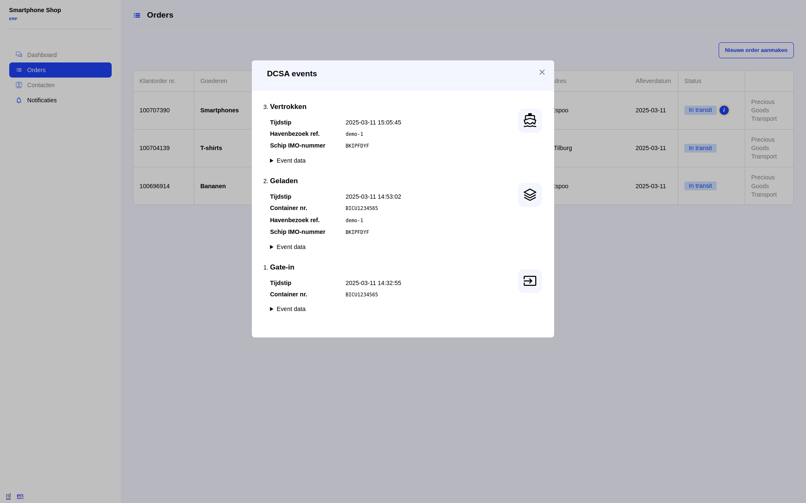

Dit document rapporteert de bevindingen die zijn voort gekomen uit de implementatie van de VGU-demo in fase 4 / LL68. De geïdentificeerde pijnpunten worden hier uiteengezet, met als doel deze te gebruiken als input voor toekomstige verbeteringen aan de architectuur, componenten en bijbehorende documentatie.

Relevante BDI Building Blocks:

- Autorisatie
- Authenticatie
- Discovery
- Event Pub/Sub
- Webhooks

# Focus fase 4: DCSA webhook events

In fase 4 beoogt men te demonstreren dat zowel een verlader als een vervoerder een update ontvangen wanneer de lading (container) een terminal binnenkomt, op een schip wordt geladen en het schip de haven verlaat.

Het uitgangspunt voor de architectuur in fase 4 is dat DCSA-events van de haven worden ontvangen via webhooks, waarna deze worden vertaald naar EPCIS-events en opnieuw worden gepubliceerd via de reeds gebruikte event broker. De events worden aangeboden door een Portbase-testsysteem en kunnen worden gesimuleerd middels een test-API.

# Bevindingen

## Inrichting abonnementen en events

Initieel werd aan Portbase één enkele webhook aangeboden, waarnaar alle events uit het testsysteem werden verzonden. In een latere implementatie werd een model geïntroduceerd waarbij men zich kan abonneren op *equipment* (container) en *vessel* (schip waarop de container is geladen).

## DCSA model

De reden voor deze opsplitsing is dat een event over het vertrek van het schip (*transport departed*) niet per container kan worden uitgedrukt in het DCSA-model.  De container is namelijk geen onderdeel van dit event in het model.  Dit zou aan de zijde van Portbase opgelost kunnen worden, waarbij zij zouden registreren op welk schip een container zich bevindt en dit event doorgeven via een container-webhook-abonnement.  Echter, deze administratieve taak is, door het gebruik van het DCSA-model, verschoven naar de consument, in dit geval de demo-applicatie.

Een voordeel van deze implementatie is dat er minder events verstuurd hoeven te worden en er aan de producerende kant geen relaties bijgehouden hoeven te worden.  Een nadeel is dat de afnemer goed moet begrijpen hoe het eventmodel in elkaar zit en (voor deze testcase) moet bijhouden op welk schip de container zich bevindt.

De overgang van container- naar scheeps-events introduceert een potentiële raceconditie: het is mogelijk dat een technische storing, of het te laat schakelen tussen abonnementen, ertoe leidt dat het vertrek van het schip niet wordt geregistreerd.  Hoewel er in de praktijk doorgaans voldoende tijd zit tussen het laden van een container en het vertrek van het schip, is het mogelijk dat een technische storing of congestie leiden tot vertraging in de ontvangst van events.

Dit probleem kan verholpen worden door bij het abonneren events die al hebben plaatsgevonden te publiceren of, zoals de DCSA-standaard voorschrijft, een query endpoint aan te bieden waar eerdere events opgehaald kunnen worden.  Deze laatste optie is inmiddels beschikbaar gemaakt door Portbase, maar niet in deze demo geïmplementeerd.

## Levensduur abonnement

Het is lastig te bepalen wanneer een abonnement opgezegd kan worden.  Door het beperkte aantal event-typen in deze demo hebben we de volgende keuzes gemaakt: het abonnement op de container wordt opgezegd zodra deze geladen is op het schip, en het abonnement op het schip wordt opgezegd zodra deze vertrokken is.  Deze aanpak zal in de praktijk niet werken, omdat bijvoorbeeld een container weer van een schip gehaald kan worden omdat deze niet vastgesjord kan worden.  Daarnaast is het ook denkbaar dat er events missen om wat voor reden dan ook.

Wanneer een abonnement opgezegd kan worden is nog een open vraag die ook bij Portbase leeft. Hoewel er in theorie altijd wel een moment te vinden is waarop er geen events meer verwacht worden die relatie hebben op een container, zou deze in de praktijk nog steeds op de kade kunnen staan.  Het is daarmee aan de afnemer om te beslissen of het abonnement in stand gehouden wordt.

## Robuustheid

Momenteel zijn er geen afspraken gemaakt over de te volgen procedure indien een van de beide partijen niet correct functioneert of bereikbaar is.  Dit betekent dat wanneer de webhook tijdelijk niet bereikbaar is, Portbase geen pogingen onderneemt om deze op een later tijdstip aan te roepen. Hetzelfde geldt voor het abonneren: indien dit niet succesvol is, wordt door de demo-applicatie geen nieuwe poging ondernomen.

Naast het ontbreken van herhaalde pogingen bij fouten, wordt bij het abonneren geen rekening gehouden met events die reeds hebben plaatsgevonden op de container of het schip waarop wordt geabonneerd. Hierdoor kan, als gevolg van timingproblemen, belangrijke informatie verloren gaan. Het in overweging nemen van reeds voorgekomen events kan het eerder beschreven probleem met betrekking tot de overgang van container- naar scheeps-events oplossen.

## Authenticatie

De BDI authenticatie / autorisatie aanpak is in overleg tussen de betrokken programmamanagementteam leden (programmamanagement, DIL-architect, en anchor developer) bewust buiten scope geplaatst.  Echter, om deze bevindingen compleet te maken reflecteren we hier wel op.

Deze toevoeging maakt geen gebruik van het afsprakenstelsel waar alle andere onderdelen van de demo aan participeren.  De Portbase-testomgeving zou hier aan toegevoegd moeten worden als participant.  Dat zou wel logisch zijn omdat er geen "vaste" relatie is tussen de verlader (ontvangende partij van events) en Portbase (verzendende partij).  Het zou beter in deze applicatie gepast hebben als abonneren en het versturen door middel van iSHARE-authenticatie-tokens zou gebeuren om daarmee te bevestigen dat beide partijen deel uitmaken van het afsprakenstelsel.  Een dergelijke opstelling zou geïmplementeerd kunnen worden met een BDI-connector.

Nogmaals, er is van te voren afgesproken dit buiten scope te plaatsen.

## Autorisatie

Er is geen beperking op welke container- of schip-events men zich kan abonneren, waardoor de binnenkomende informatie in feite openbaar is voor iedereen die over een API-key beschikt. Deze gegevens zouden misbruikt kunnen worden door kwaadwillenden. Door gebruik te maken van het afsprakenstelsel, zoals beschreven in de sectie over authenticatie, kan dit risico worden beperkt.

Ook hier geldt dat de BDI authenticatie / autorisatie aanpak in overleg tussen de betrokken programmamanagementteam leden (programmamanagement, DIL-architect, en anchor developer) bewust buiten scope is geplaatst.

## Ontwikkelen met webhooks

Ondanks de aangeboden API voor het nabootsen van events, is softwareontwikkeling met webhooks complex omdat de ontwikkelomgeving bereikbaar moet zijn voor de partij die de aanroep naar de webhook uitvoert.

Bij het ontwikkelen van deze demo was het nuttig dat de Portbase-testomgeving een webhook aanroep (HTTP request) kon doen op de ontwikkel-omgeving van de VGU ontwikkelaars. Hiervoor hebben we SSH-tunnels en een Cloud VPS gebruikt om toegang van de Portbase-testomgeving naar de ontwikkelomgeving te regelen.

## Vertalen van events

In fase 3 is gekozen voor EPCIS events (naar aanleiding van LEO, Light Event Ontology), terwijl in deze fase door Portbase voor DCSA events is gekozen. De DCSA events worden nu in de demo vertaald naar EPCIS om ze te kunnen propageren naar andere partijen. Er is echter een semantisch verschil tussen de typen events, wat tot problemen kan leiden: EPCIS events refereren aan de start van een gebeurtenis ("departing", "arriving", "loading" etc.), terwijl DCSA events refereren aan de afronding ervan ("departed", "loaded" etc.).  Dit kan problemen opleveren bij de interpretatie van events.

Voor deze use-case is DCSA een logische keuze omdat het om container verkeer gaat.  Vertalingen tussen event modellen is een vraagstuk dat nog volop in ontwikkeling is in DIL/BDI.

# Geleerde lessen

## Events versus notificaties

Voor de events in een eerdere fase van deze demo is gekozen voor het *notificatiemodel*, waarbij alleen notificaties verstuurd worden waarna de ontvanger het daadwerkelijke event nog moet ophalen.  Dat heeft als nadeel dat de producent een endpoint moet aanbieden waar de events opgehaald kunnen worden en de ontvangende partij het event moet ophalen.

In de koppeling met Portbase wordt het volledige event meteen aangeboden.  Dit heeft de implementatie aan beide zijden eenvoudiger gemaakt.

## Life cycle

Het is verstandig om vooraf duidelijk af te spreken hoe lang het zinvol is om geabonneerd te blijven op events van bijvoorbeeld containers en schepen.  Hierbij kunnen voorbeeld uitzonderingen doorgenomen worden zodat de ontvanger kan bepalen hoe lang deze *geïnteresseerd* blijft.

## Webhooks versus event brokers

Het gebruik van webhooks heeft als nadeel dat de ontvanger bereikbaar moet zijn via het gebruikte netwerk, maar is qua beheer gemakkelijker te implementeren en beheren dan een event broker.  Hoewel foutafhandeling bij het gebruik van event brokers eenvoudiger te implementeren is, is het gemakkelijk hier van tevoren duidelijke afspraken over te maken en deze vervolgens te implementeren.

# Te doen

Uit de geleerde lessen kunnen we concluderen dat er werk is om de BDI architectuur aan te scherpen en uit te breiden met aanbevelingen voor het implementeren van soortgelijke systemen.

## Webhooks / Event Broker / Notificaties pros en cons

Om een goede keuze te kunnen maken tussen het gebruik van webhooks en een of meerdere event brokers moet een pros- en cons-matrix opgezet worden waarmee organisaties gemakkelijk kunnen bepalen welke de best passende oplossing is voor hun situatie.  Belangrijke aspecten hierbij zijn: beheersbaarheid, compatibiliteit en complexiteit.

## Webhook foutafhandeling

Er moet duidelijk beschreven worden hoe foutcodes aan de kant van de webhook (afnemer) afgehandeld worden.  Voor de hand ligt om HTTP-codes in de 500-range later nog een keer te proberen, misschien ook voor de 400-range.  Over hoe vaak dat moet gebeuren en hoe lang, moeten afspraken gemaakt worden.  Hierover gaan we advies geven.

## Event model beschrijving

In de beperkte scope van deze demo hebben we enkel 3 typen events gebruikte waarbij het duidelijk is welke sequentie(s) er mogelijk zijn en op welk moment er geen events meer verwacht worden.  In de praktijk zullen het veel meer typen events voorkomen en zullen er veel verschillende sequentie mogelijkheden bestaan.  Interpretatie en life cycle worden daardoor een stuk ingewikkelder en moeten dus vooraf goed beschreven zijn.

Binnen de BDI wordt op dit moment aan LEO (Light Event Ontology) gewerkt en de gevonden interpretatie en life cycle complexiteit zou daarin meegenomen moeten worden.

<!-- Local Variables: -->
<!-- ispell-local-dictionary: "dutch" -->
<!-- End: -->
