# SPDX-FileCopyrightText: 2024, 2025 Jomco B.V.
# SPDX-FileCopyrightText: 2024, 2025 Topsector Logistiek
# SPDX-FileContributor: Remco van 't Veer <remco@jomco.nl>
#
# SPDX-License-Identifier: AGPL-3.0-or-later

#+TITLE: Demo script
#+OPTIONS: ':t toc:1
#+LANGUAGE: nl

\clearpage

* Inleiding

In deze voorbeeldapplicatie worden de volgende elementen
gedemonstreerd:

- autorisatie van een chauffeur bij het ophalen van goederen;

- uitbesteding van een transportopdracht naar een ander transportbedrijf;

- voortgangsberichten (events) tussen locaties d.m.v. een event
  broker (Apache Pulsar);

- voortgangsberichten d.m.v. webhooks (Portbase).

Om deze elementen te kunnen demonstreren, bestaat deze applicatie uit
de volgende omgevingen:

#+ATTR_LATEX: :width 1.0\textwidth
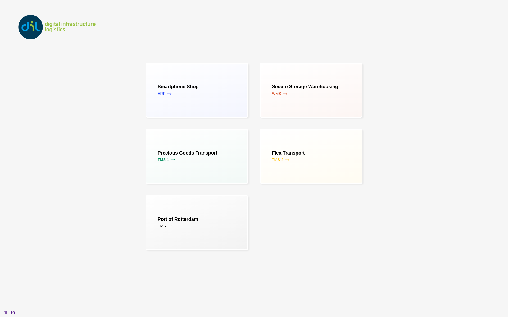
\clearpage

- ERP

  De omgeving van de verlader.  Hierin worden "klantorders" aangemaakt
  door de verlader om goederen op te halen bij een DC en elders te
  bezorgen.  Deze opdrachten worden hier toegewezen aan een vervoerder
  en doorgestuurd naar TMS en WMS (zie onder).

- WMS

  Het Warehouse Management Systeem op het DC.  Hierin worden
  "ophaal"-opdrachten geregistreerd en de chauffeur gecontroleerd.

- TMS-1

  Het Transport Management Systeem van het transportbedrijf.  Hier
  wordt de transportopdracht ingepland en een chauffeur / vrachtwagen
  toegewezen of uitbesteed aan een andere vervoerder.

- TMS-1 (Chauffeur)

  Schermen in het TMS, speciaal bedoeld voor chauffeurs, voor het
  laten zien van een QR-code.

- TMS-2

  De schermen van het andere transportbedrijf.

- PMS

  Een omgeving om bij Portbase events aan te vragen om het binnenkomen
  en laden van goederen (container) en vertrekken van een schip te
  simuleren.

\clearpage

* Autorisatie van een chauffeur en gate-out event
<<scenario-1>>

De autorisatie van een chauffeur om goederen te mogen ophalen verloopt
in 4 stappen:

- de verlader autoriseert het transportbedrijf

- het transportbedrijf autoriseert een chauffeur

- het distributiecentrum (DC) verifieert de autorisatie van de chauffeur
  bij het transportbedrijf

- het DC verifieert de autorisatie van het transportbedrijf bij de
  verlader

\clearpage

** ERP
<<erp>>

Ga naar ERP-1 op de overzichtspagina:

#+ATTR_LATEX: :width 1.0\textwidth
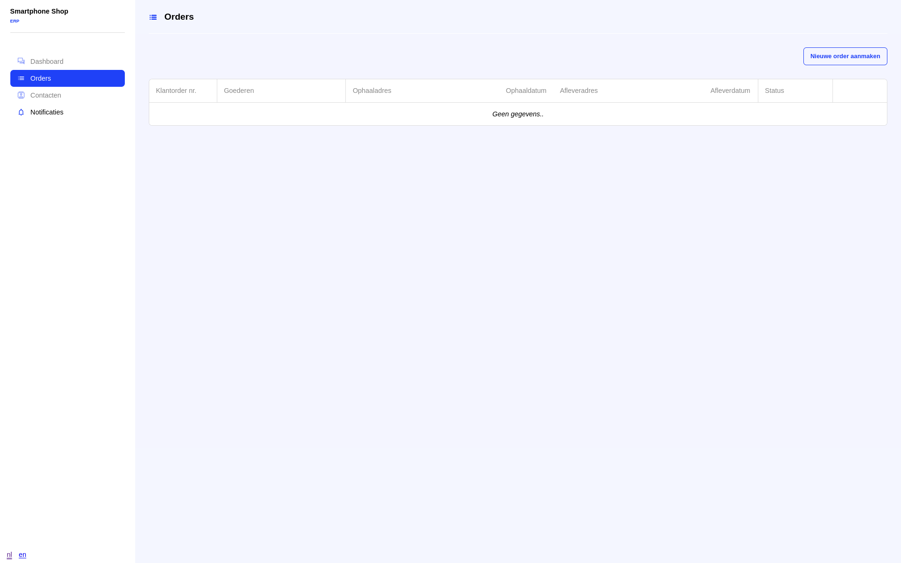
\clearpage

Maak een nieuwe opdracht aan met de "Nieuw order aanmaken"-knop.

#+ATTR_LATEX: :width 1.0\textwidth
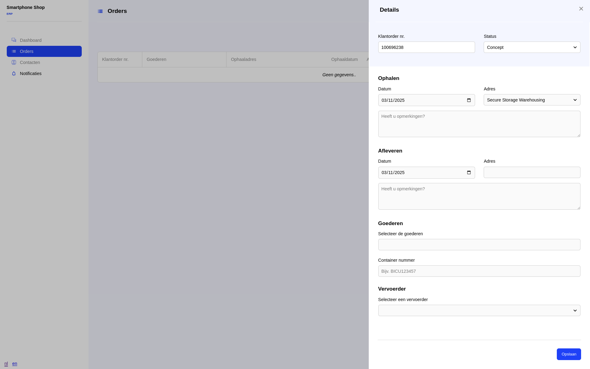

Vul hier het "Afleveradres", de "Goederen" en de "Vervoerder" in,
bijvoorbeeld "Nokia, Espoo", "Bananen" en "Precious Goods Transport",
en sla op met "Opslaan".  Tip: kies een "Afleveradres" uit de
suggesties om in latere schermen een volledig adres te zien.  Goederen
kunnen vrij ingevuld worden en "Container nummer" kan voor dit
scenario leeg gelaten worden.

Let op: voor "Ophalenadres" (het DC) en "Vervoerder" zijn beperkte
keuzemogelijkheden.  Het gaat hier namelijk om de ook behandelde WMS-
en TMS-omgevingen.

\clearpage

#+ATTR_LATEX: :width 1.0\textwidth
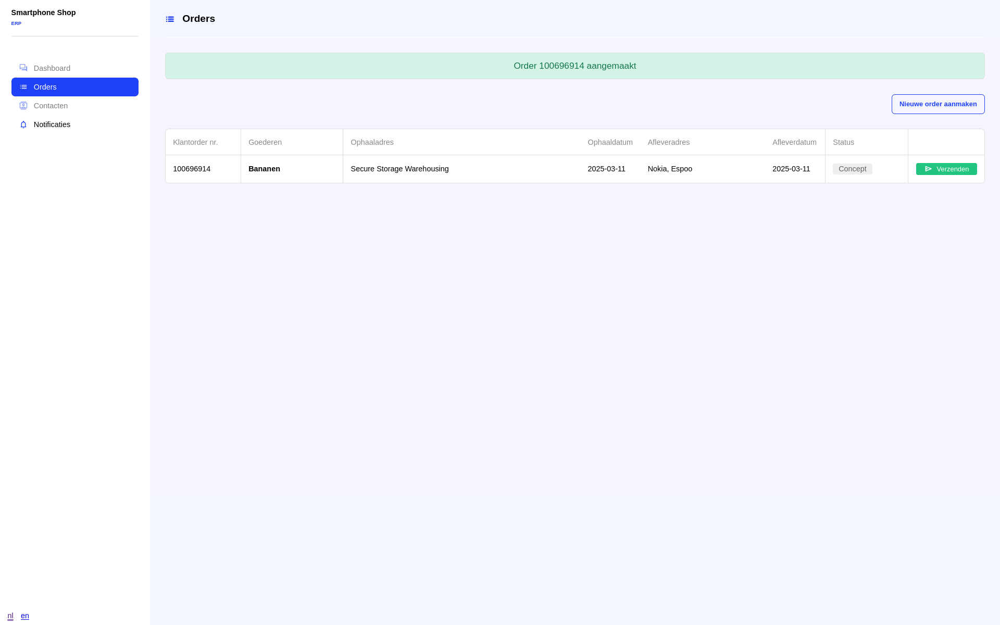

Verstuur de zojuist aangemaakte klantorder naar het DC en de
vervoerder met de bijbehorende "Verzenden"-knop.

#+ATTR_LATEX: :width 1.0\textwidth
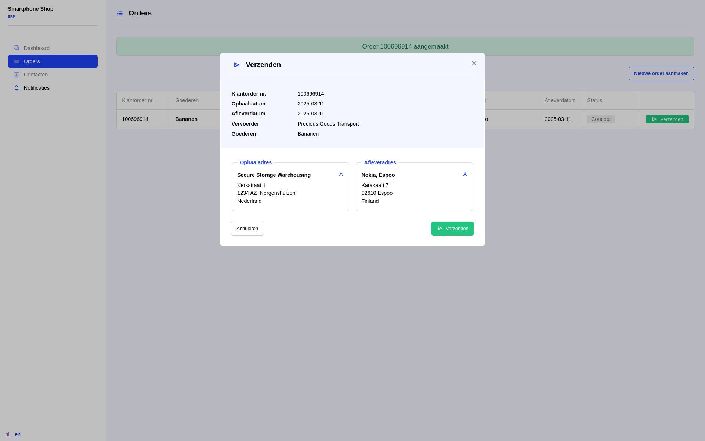
\clearpage

Je bevindt je nu op een bevestigingsscherm.  Druk op "Verzenden" voor
het daadwerkelijke doorzetten van de opdracht.

#+ATTR_LATEX: :width 1.0\textwidth
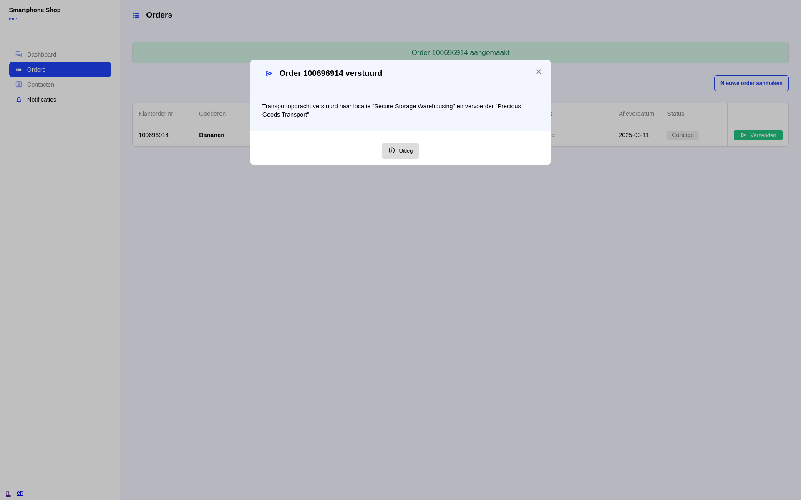
\clearpage

In de uitklapbare "Uitleg" is te zien dat de opdracht verstuurd is
naar het WMS en het TMS.  De eerste 2 stappen vallen buiten de scope
van deze demo.  Voor dit scenario zijn stappen 3, 4 en 5 belangrijk om
uit te lichten, omdat hier door de verlader respectievelijk:

- het transportbedrijf geautoriseerd wordt om goederen op te halen;

- het transportbedrijf geautoriseerd wordt om events van de event
  broker te mogen ontvangen en het DC geautoriseerd wordt om events te
  publiceren;

- de verlader zich abonneert op gebeurtenissen op deze opdracht bij de
  event broker.

#+ATTR_LATEX: :width 1.0\textwidth
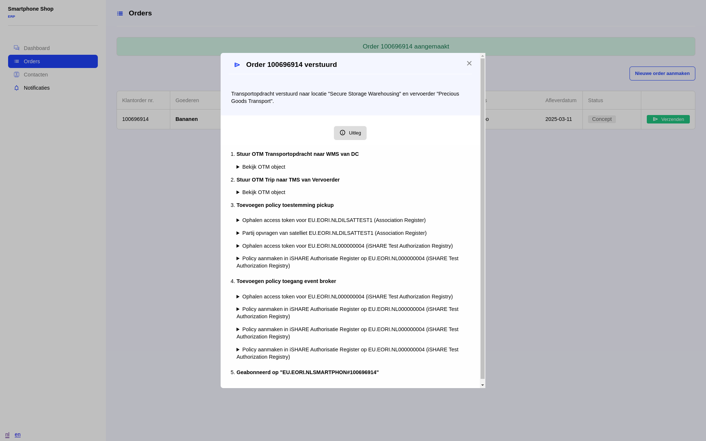

\clearpage

** TMS-1
<<scenario-1-tms>>

De opdracht is nu aangekomen in het TMS van "Precious Goods
Transport".  Ga naar TMS-1 op de overzichtspagina (klik linksboven op
"smartphone shop").

#+ATTR_LATEX: :width 1.0\textwidth
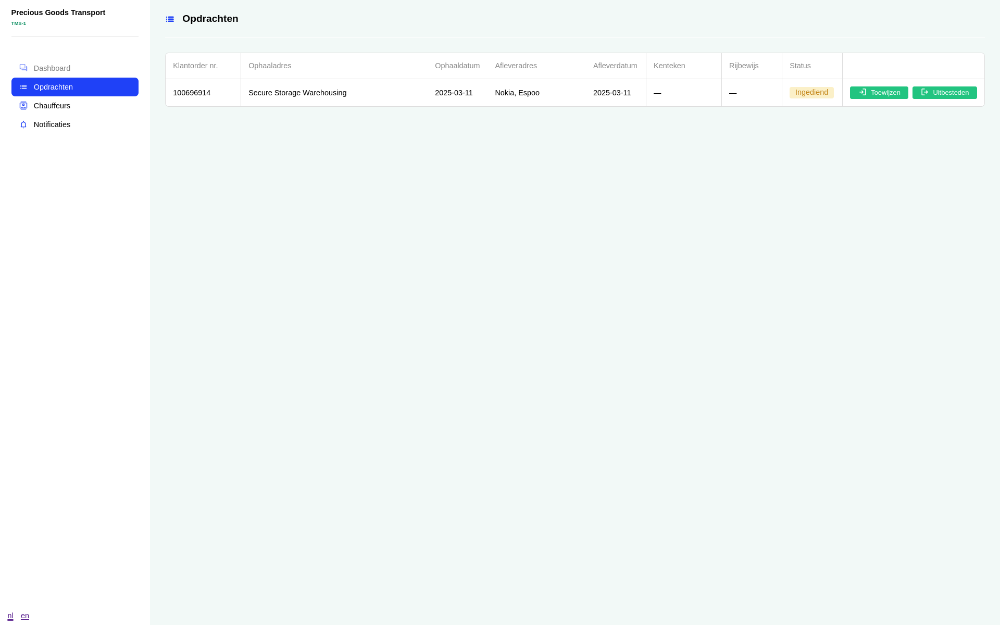

Het is nu mogelijk deze opdracht toe te wijzen aan een chauffeur en
vrachtwagen of uit te besteden bij een andere vervoerder.  Druk op de
"Toewijzen"-knop.

#+ATTR_LATEX: :width 1.0\textwidth
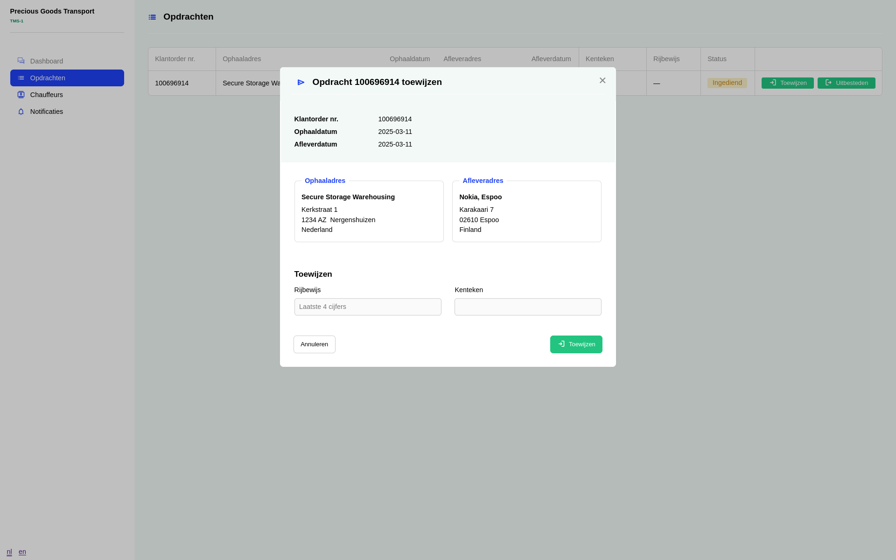

Voer de velden "Rijbewijs" en "Kenteken" in om een chauffeur en
vrachtwagen toe te wijzen aan deze opdracht, bijvoorbeeld "4321" en
"ABC12YZ" en druk op "Toewijzen".

#+ATTR_LATEX: :width 1.0\textwidth
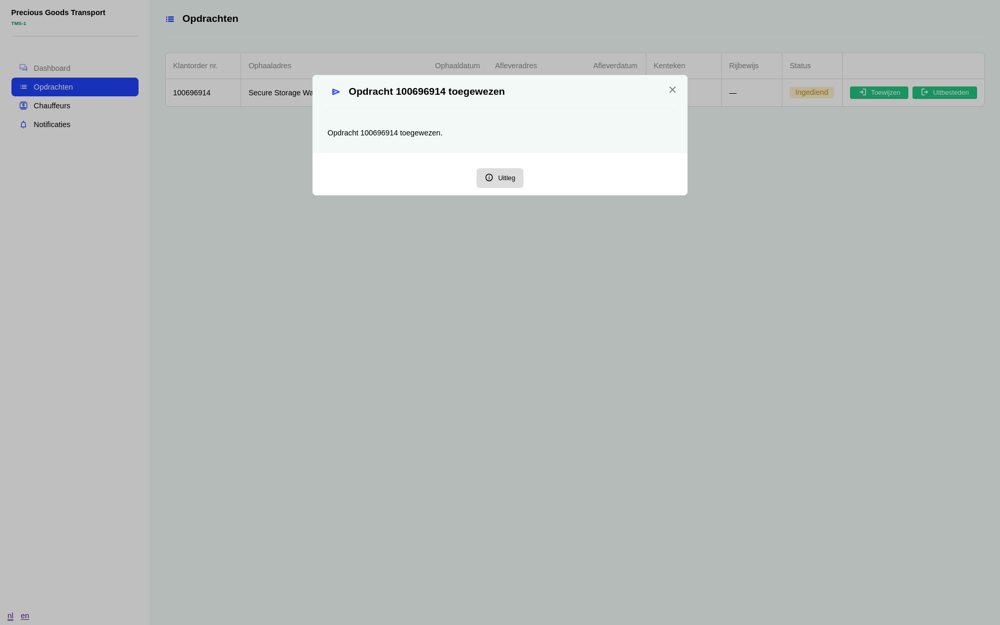

In de uitklapbare "Uitleg" is te zien dat de chauffeur geautoriseerd
is door het transportbedrijf om de goederen op te halen en dat er
geabonneerd wordt op gebeurtenissen op deze opdracht bij de event
broker.

#+ATTR_LATEX: :width 1.0\textwidth
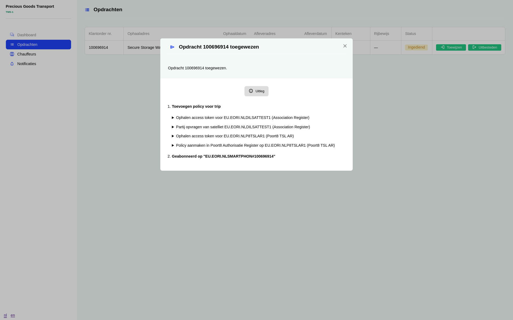

\clearpage

** TMS-1 (Chauffeur)

De QR-code is nu beschikbaar voor de chauffeur.  Kies
"Chauffeurs" in het linkermenu.

#+ATTR_LATEX: :width 1.0\textwidth
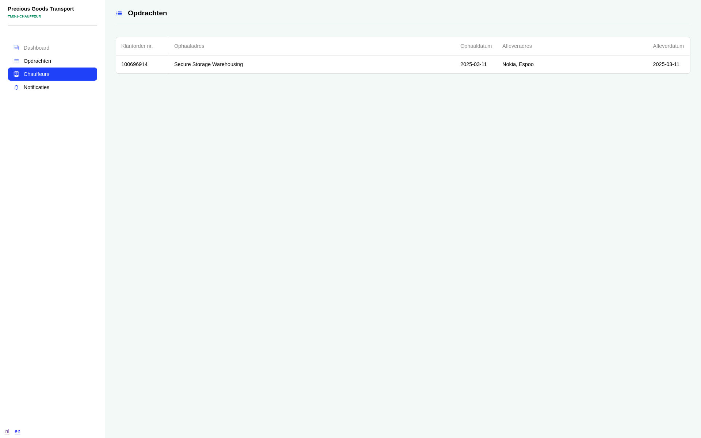
\clearpage

Kies de rit om de QR-code te zien.

#+ATTR_LATEX: :width 1.0\textwidth
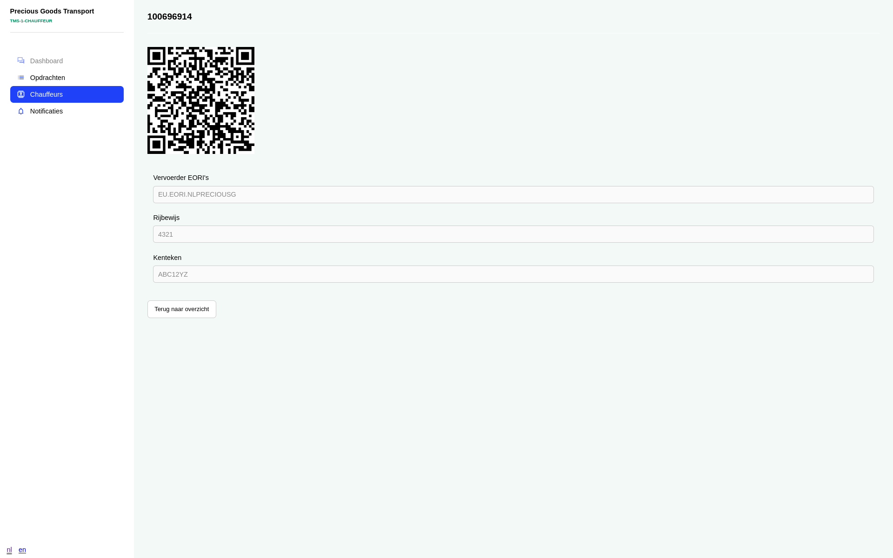

In de QR-code zijn de onderstaande gegevens gecodeerd, zodat het DC de
autorisatie kan verifiëren:

- Vervoerder EORI :: EU.EORI.NLPRECIOUSG

- Rijbewijs :: 4321

- Kenteken :: ABC12YZ

\clearpage

** WMS
<<scenario-1-wms>>

De opdracht is ook al bekend in het WMS en kan nu volledig
geverifieerd worden.  Kies WMS in de overzichtspagina.

#+ATTR_LATEX: :width 1.0\textwidth
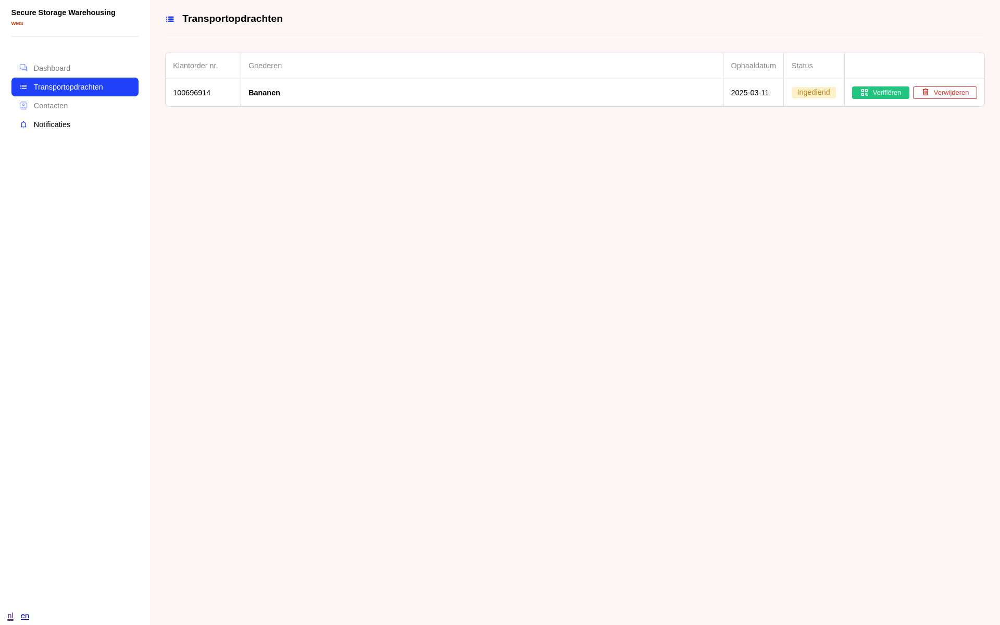
\clearpage

Druk op "Verifiëren" om te controleren of de chauffeur de vracht mag
ontvangen.

#+ATTR_LATEX: :width 1.0\textwidth
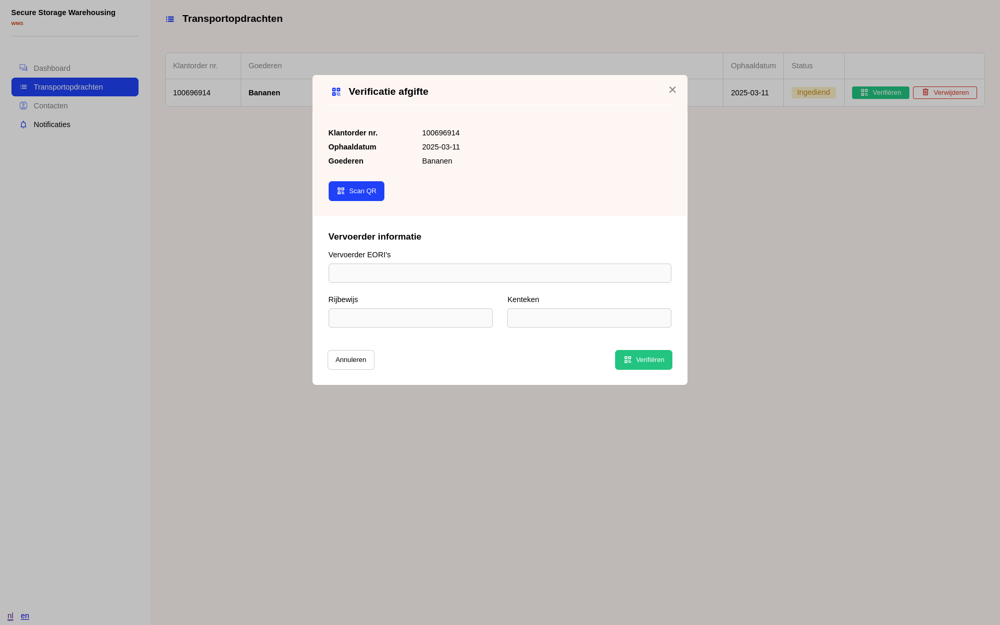

Hier zijn een "Scan QR"-knop en invoervelden te vinden.  Het scannen
van een QR-code zorgt ervoor dat de velden "Vervoerder EORI's",
"Rijbewijs" en "Kenteken" automatisch ingevuld worden.  Het scannen
van een QR-code is lastig in een videogesprek het is daarom handiger
om deze velden met de hand in te vullen:

- Vervoerder EORI :: EU.EORI.NLPRECIOUSG

- Rijbewijs :: 4321

- Kenteken :: ABC12YZ (let op, dit veld is hoofdlettergevoelig!)

\clearpage

Druk op "Verifiëren", er wordt nu nog extra gevraagd of het rijbewijs
en kenteken overeenkomen met die van de chauffeur en vrachtwagen.

#+ATTR_LATEX: :width 1.0\textwidth
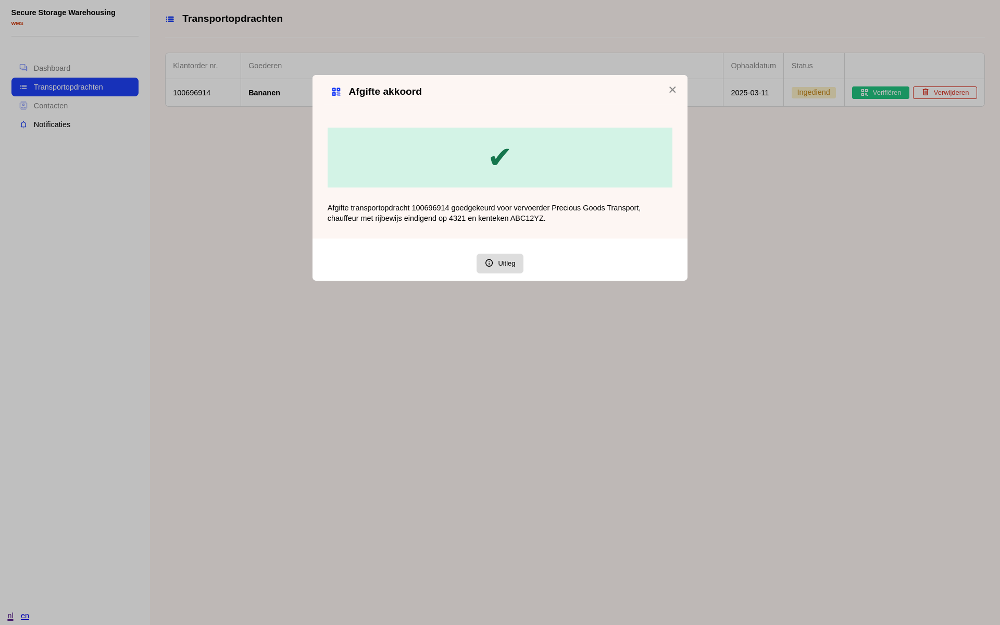

Hier is geverifieerd of de verlader de vervoerder toestaat de zending
op te halen en of de vervoerder de chauffeur met vrachtwagen toestaat
de zending aan te nemen.

In de uitklapbare "Uitleg" is te zien dat de /Autorisatie Registers/
van de verlader en het transportbedrijf bevraagd worden.

#+ATTR_LATEX: :width 1.0\textwidth
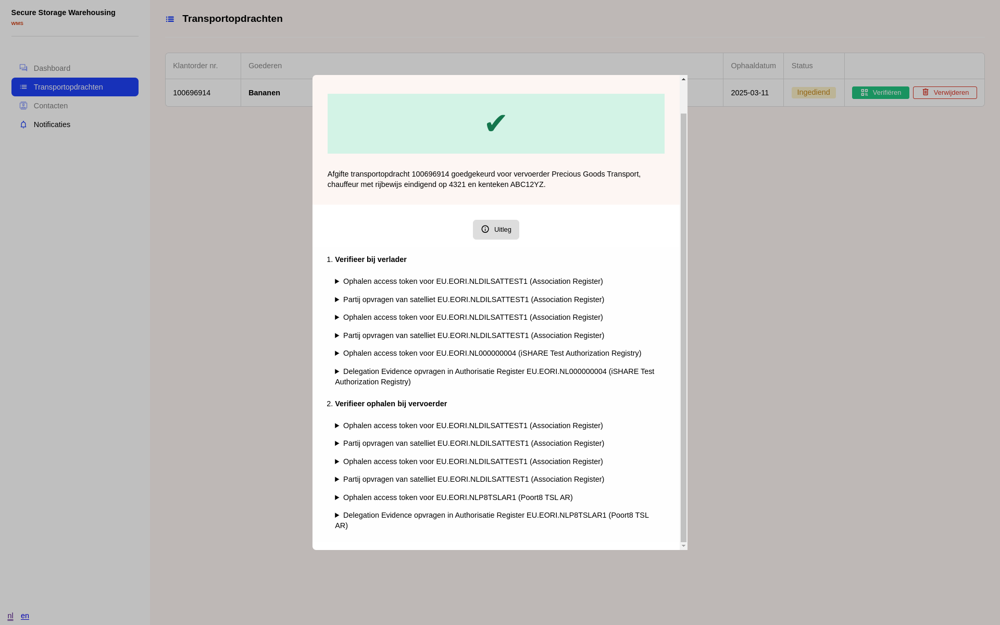

\clearpage

** Gate-out
<<scenario-1-gate-out>>

Na succesvolle verificatie is het mogelijk een gate-out bij de event
broker te publiceren over deze zending.

#+ATTR_LATEX: :width 1.0\textwidth
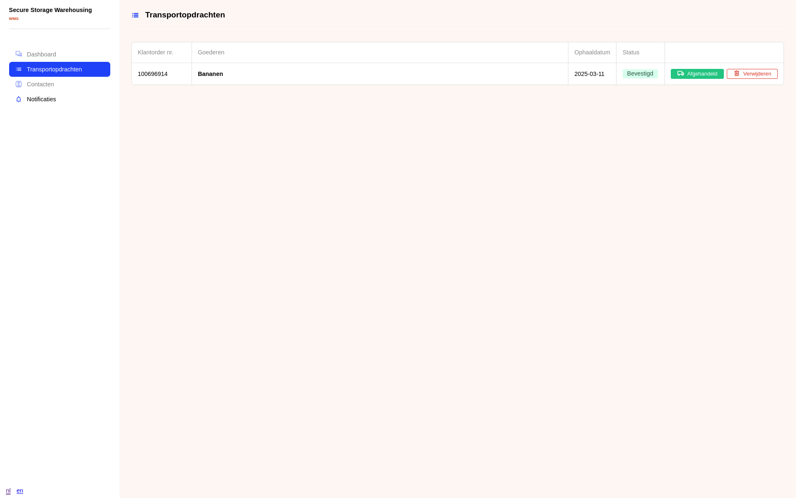

Het is nu mogelijk een gate-out event te versturen door op de
"Afgehandeld"-knop te drukken.

#+ATTR_LATEX: :width 1.0\textwidth
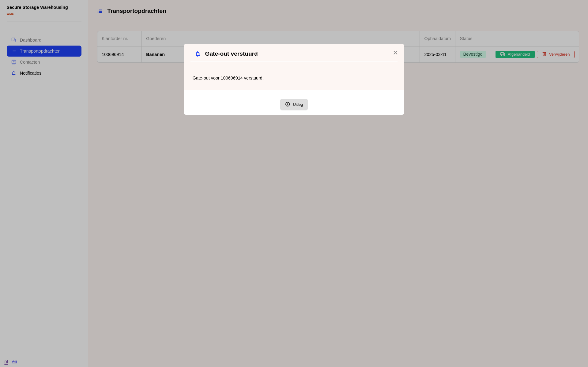

In de uitklapbare "Uitleg" is te zien dat er een bericht gestuurd is
met een URL erin naar de event broker.

#+ATTR_LATEX: :width 1.0\textwidth
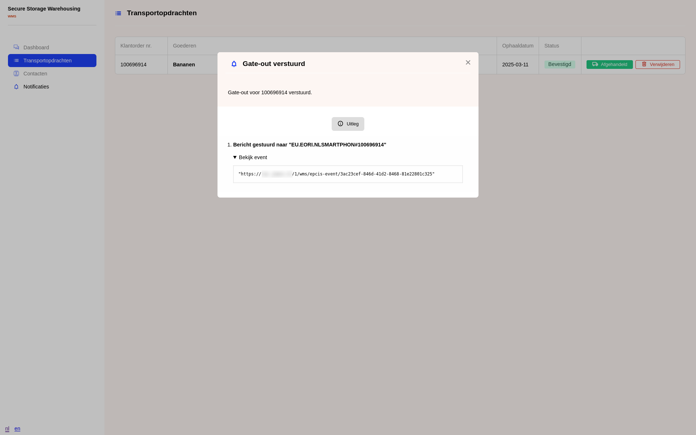

Partijen die dit bericht ontvangen via de event broker, gebruiken
deze link om de gebeurtenis op te halen bij de partij die het bericht
verstuurd heeft (in dit geval het DC).

\clearpage

** In Transit

Terug in het ERP is nu te zien dat de status van de opdracht is
veranderd van "Ingediend" naar "In transit".

#+ATTR_LATEX: :width 1.0\textwidth
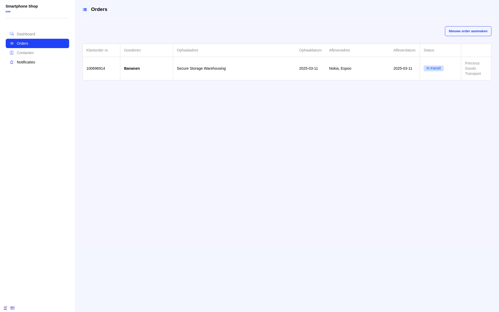

Kies "Notificaties" in het linkermenu om te zien hoe het bericht van
de event broker verwerkt is.

#+ATTR_LATEX: :width 1.0\textwidth
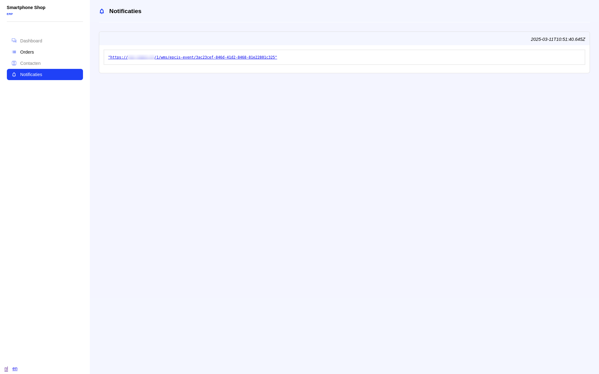

Hier zijn alle ontvangen berichten van de event broker te zien.
Klik op de link (die naar het WMS wijst, omdat deze het event heeft
verstuurd en dus eigenaar is van deze data).

#+ATTR_LATEX: :width 1.0\textwidth
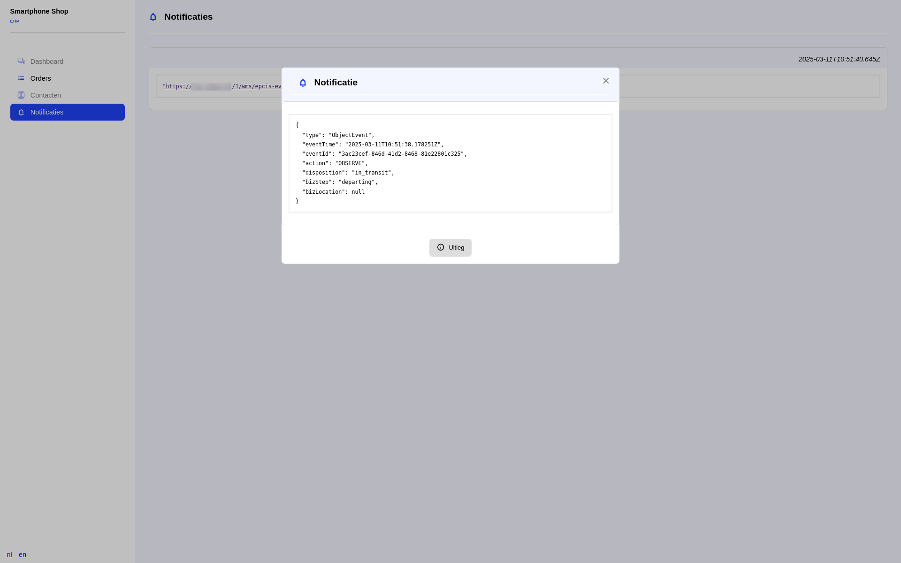

In de "Uitleg" is te zien dat het bericht op een beveiligde manier
opgehaald is.

#+ATTR_LATEX: :width 1.0\textwidth
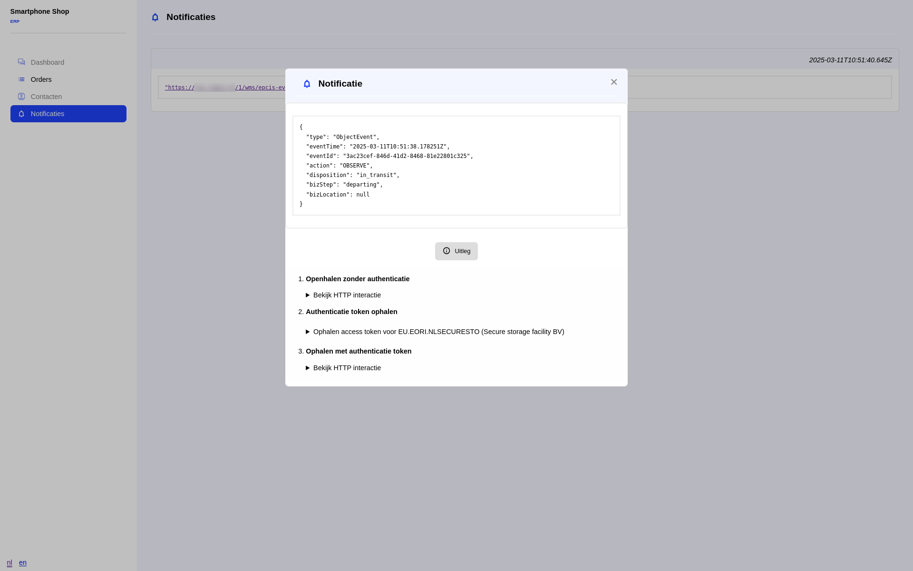

\clearpage

Hetzelfde bericht is ontvangen door TMS-1, daar is ook zichtbaar dat
de opdracht "In Transit" is en is dezelfde notificatie te vinden.

#+ATTR_LATEX: :width 1.0\textwidth
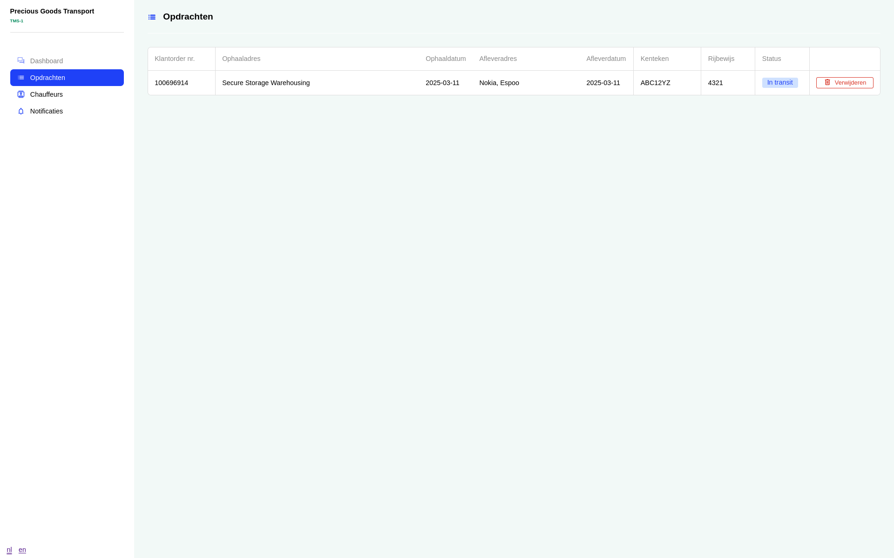

\clearpage

* Uitbesteden
<<scenario-2>>

Bij een uitbesteding wordt in deze demo het eerste transportbedrijf
(TMS-1) geautoriseerd door de verlader om een opdracht uit te voeren
en het transportbedrijf autoriseert een derde transportbedrijf (TMS-2)
om de opdracht uit te voeren.

\clearpage

** TMS-1

Om dit te demonstreren, maken we een nieuwe opdracht aan en versturen
we deze naar TMS-1, zoals in sectie [[erp]].  Daarna gebruiken we in het
TMS-1 overzicht de "Uitbesteden"-knop.

#+ATTR_LATEX: :width 1.0\textwidth
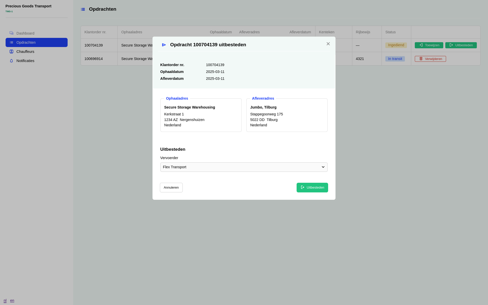

Kies het (enige) andere transportbedrijf "Flex Transport" en druk op
"Uitbesteden".

#+ATTR_LATEX: :width 1.0\textwidth
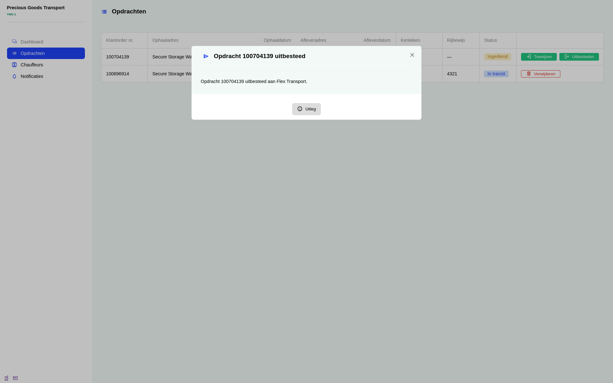

De opdracht is nu doorgestuurd naar TMS-2 en in de "Uitleg" is te zien
dat "Flex Transport" door "Precious Goods Transport" geautoriseerd
wordt om de goederen op te halen.

#+ATTR_LATEX: :width 1.0\textwidth
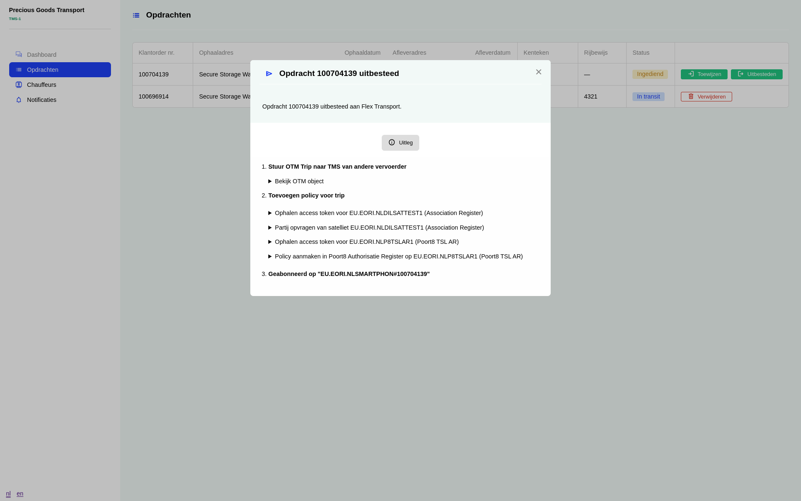

\clearpage

** TMS-2

In TMS-2 is nu de uitbestede opdracht te vinden.

#+ATTR_LATEX: :width 1.0\textwidth
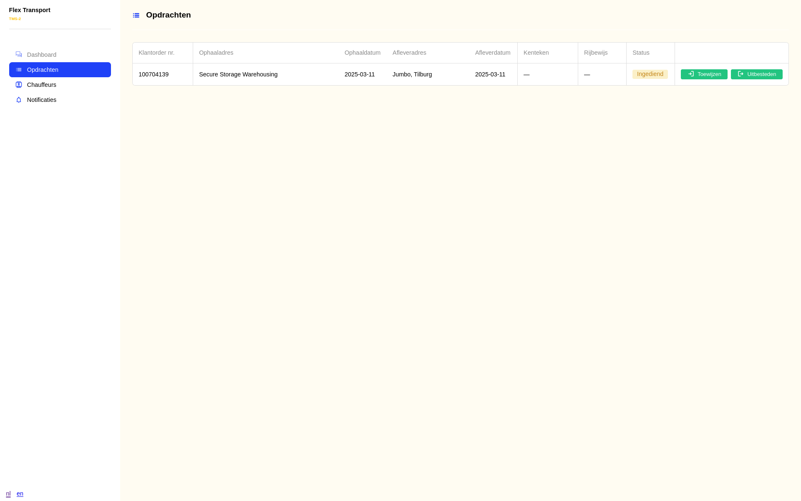

Hier kan de opdracht toegewezen worden aan een chauffeur en
vrachtwagen of uitbesteed worden bij een andere vervoerder.  Druk op
de "Toewijzen"-sknop.

#+ATTR_LATEX: :width 1.0\textwidth
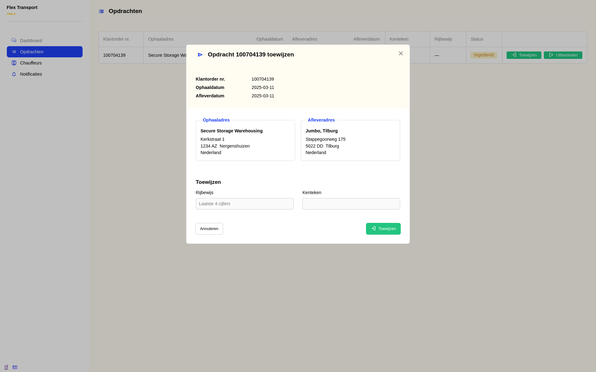

\clearpage

Voer de velden "Rijbewijs" en "Kenteken" in om een chauffeur en
vrachtwagen toe te wijzen aan deze opdracht, bijvoorbeeld "7890" en
"YZ09ABC" en druk op "Toewijzen".  In de uitklapbare "Uitleg" is te
zien dat de chauffeur geautoriseerd is door het transportbedrijf om de
goederen op te halen.

#+ATTR_LATEX: :width 1.0\textwidth
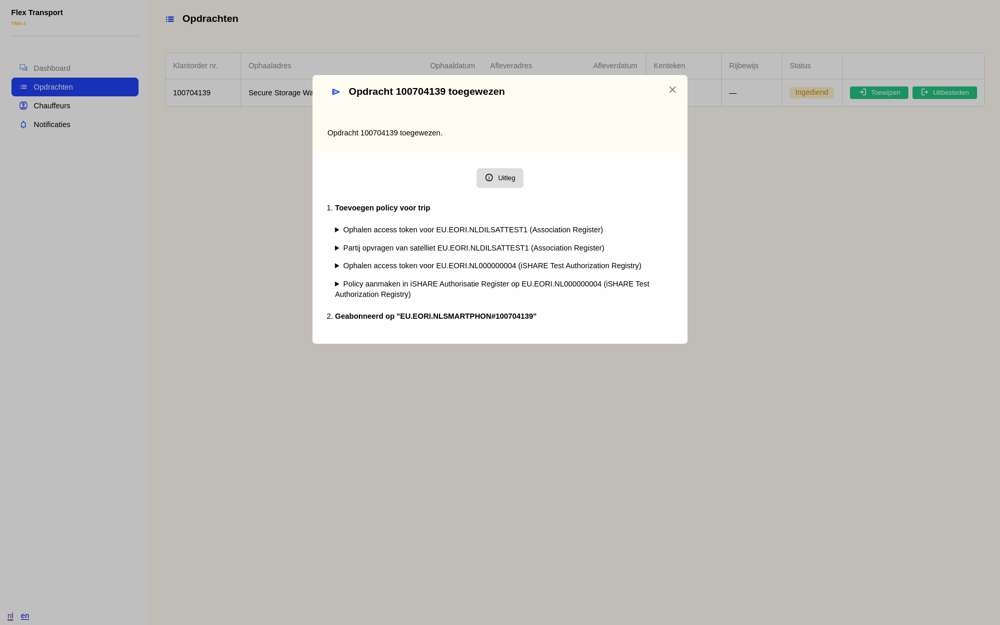

\clearpage

** TMS-2 (Chauffeur)
<<scenario-2-chaffeur>>

De QR-code is nu beschikbaar voor de chauffeur.  Kies
"Chauffeurs" in het linkermenu.

#+ATTR_LATEX: :width 1.0\textwidth
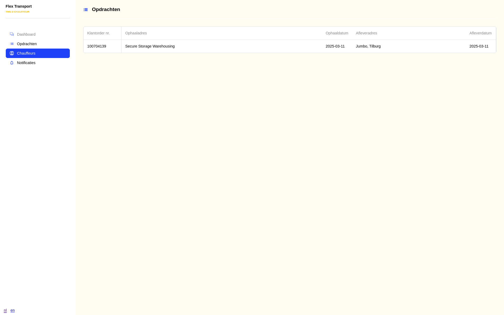

\clearpage

Kies de rit om de QR-code te zien.

#+ATTR_LATEX: :width 1.0\textwidth
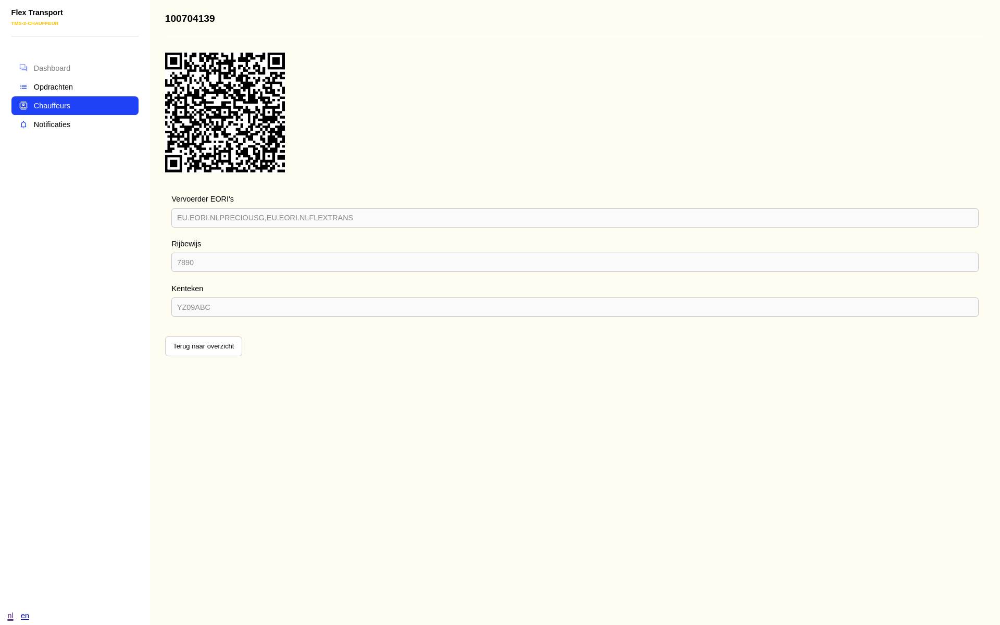

In de QR-code zijn de onderstaande gegevens gecodeerd, zodat het DC de
autorisatie kan verifiëren:

- Vervoerder EORI :: EU.EORI.NLPRECIOUSG,EU.EORI.NLFLEXTRANS

- Rijbewijs :: 7890

- Kenteken :: YZ09ABC

Merk op dat de EORI's van *beide* transportbedrijven in de QR-code
opgenomen worden zodat het WMS straks weet wat het /pad/ van de
autorisatie is geweest.

\clearpage

** WMS

Terug in het WMS kan nu de chauffeur van de derde partij geverifieerd
worden.

#+ATTR_LATEX: :width 1.0\textwidth
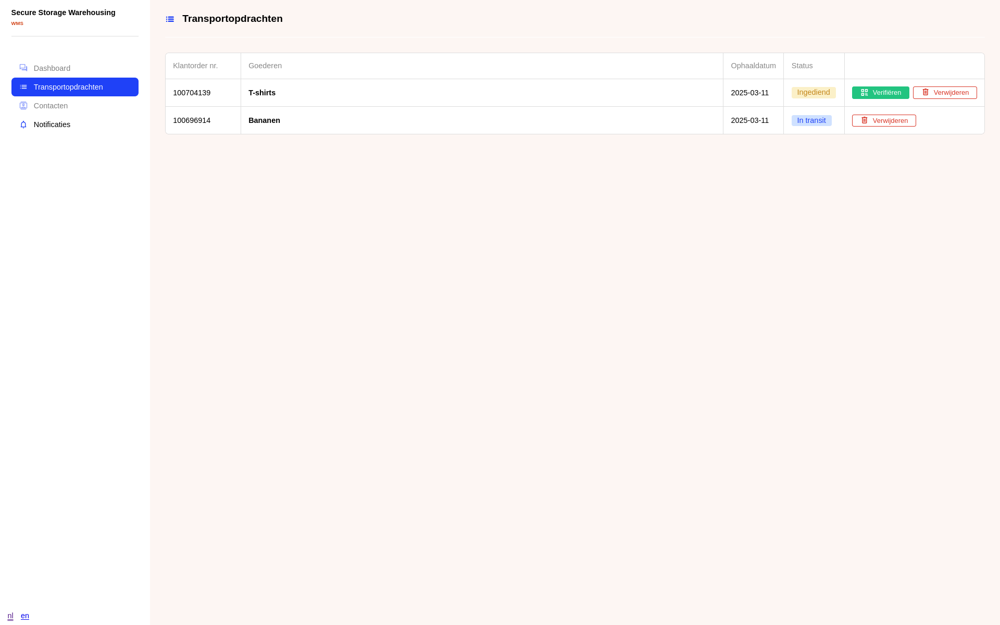

Druk op "Verifiëren" om te controleren of de chauffeur de vracht mag
ontvangen.

#+ATTR_LATEX: :width 1.0\textwidth
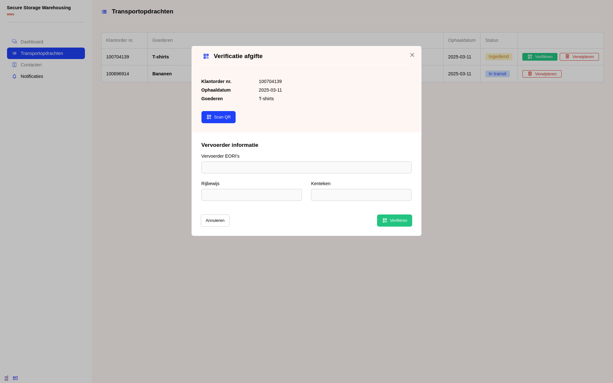

\clearpage

Gebruik de QR-codescanner of vul de velden in zoals weergegeven op het
scherm van de chauffeur in sectie [[scenario-2-chaffeur]].

#+ATTR_LATEX: :width 1.0\textwidth
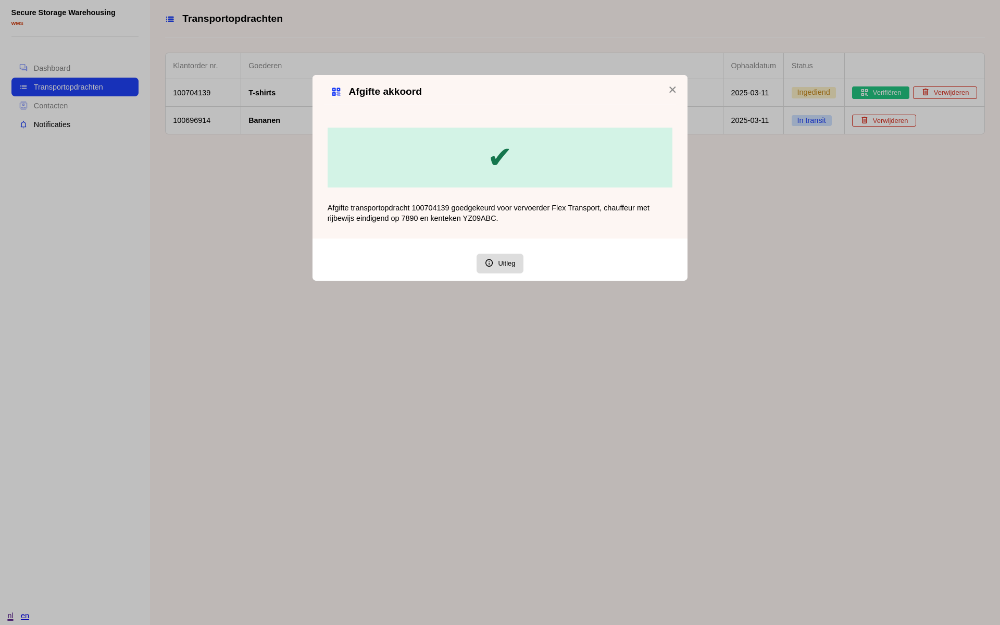

In de uitleg is te zien dat:

1. de verlader het eerste transportbedrijf geautoriseerd heeft om de
   opdracht uit te voeren
2. het transportbedrijf een ander transportbedrijf geautoriseerd heeft
   om de opdracht uit te voeren
3. de chauffeur door het tweede transportbedrijf geautoriseerd is om
   goederen op te halen

* Container events
<<scenario-3>>

Zodra er in deze demo-omgeving een "Container nummer" toegewezen wordt
aan een opdracht, gebeurt er iets extra's bij het verzenden van de
opdracht: er wordt bij Portbase een webhook geregistreerd waarop
berichten over de afhandeling op de terminal ontvangen kunnen worden.

\clearpage

** ERP

We maken net als in sectie <<erp>> een nieuwe opdracht aan en voeren
hier een container nummer bij in: "BICU1234565".

#+ATTR_LATEX: :width 1.0\textwidth
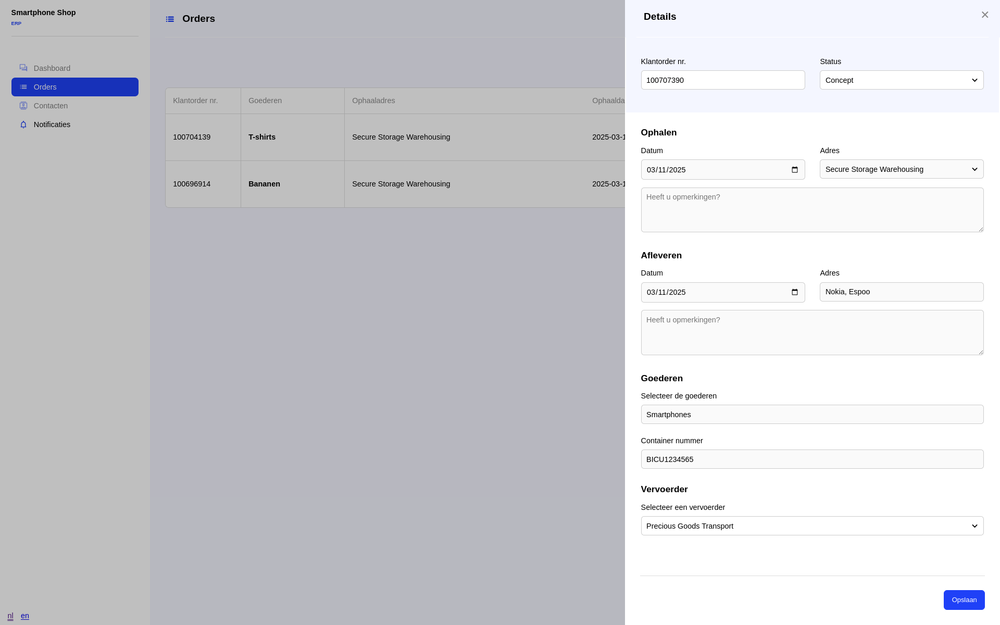

In de "Uitleg" bij "Verzenden" is nu te zien dat er geabonneerd is op
Portbase events (punt 6).

#+ATTR_LATEX: :width 1.0\textwidth
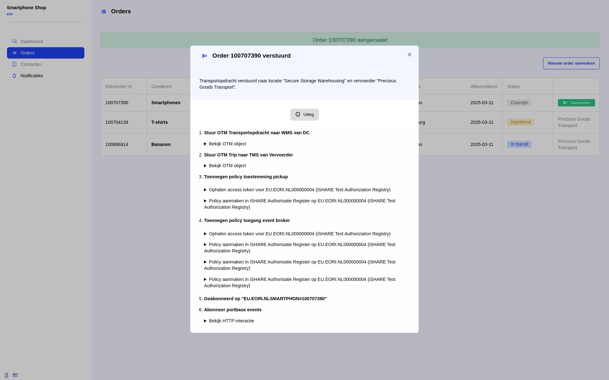

** TMS-1 en WMS

Het transportbedrijf wijst een chauffeur toe zoals in sectie
[[scenario-1-tms]].  Bij het DC wordt de chauffeur bij aankomst
geverifieerd en de opdracht als afgehandeld beschouwd, zoals in sectie
[[scenario-1-wms]] en [[scenario-1-gate-out]].  Nu staat de opdracht in het
ERP en en TMS-1 op de status "In transit".

#+ATTR_LATEX: :width 1.0\textwidth
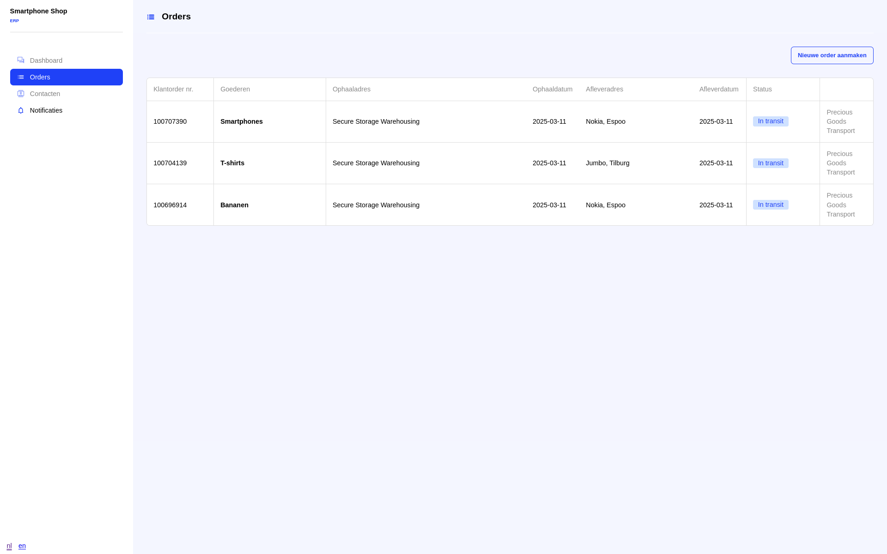

#+ATTR_LATEX: :width 1.0\textwidth
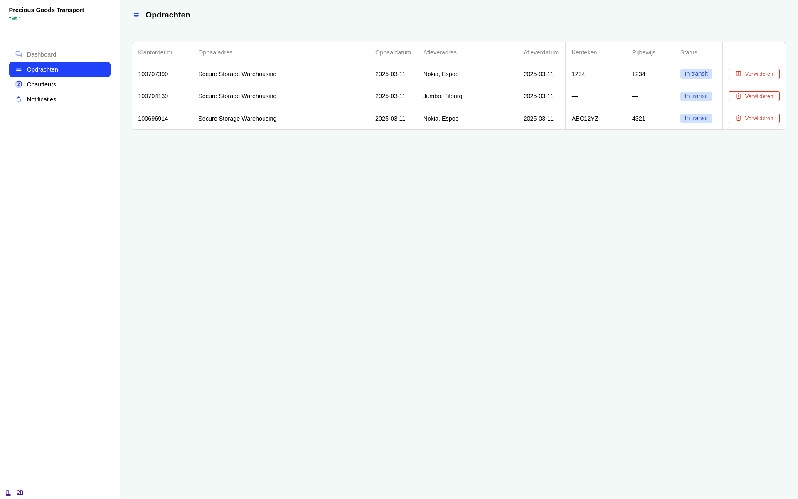

** PMS

In het PMS zorgen we nu dat er een event vanuit Portbase gesimuleerd
gaat worden.

#+ATTR_LATEX: :width 1.0\textwidth
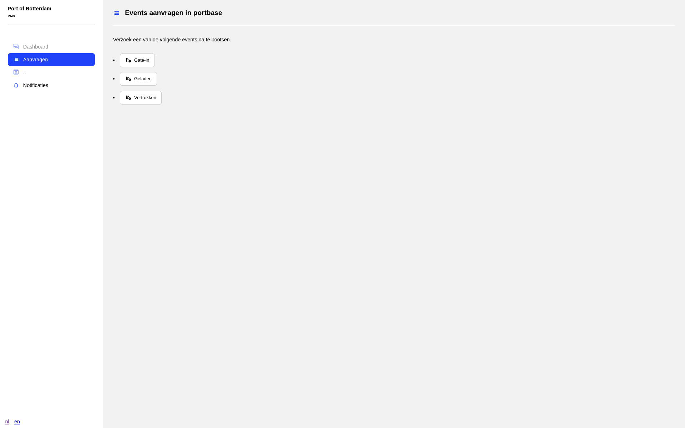

** Gate-in

Kies "Gate-in" om te simuleren dat de container bij de terminal
aangekomen is.

#+ATTR_LATEX: :width 1.0\textwidth
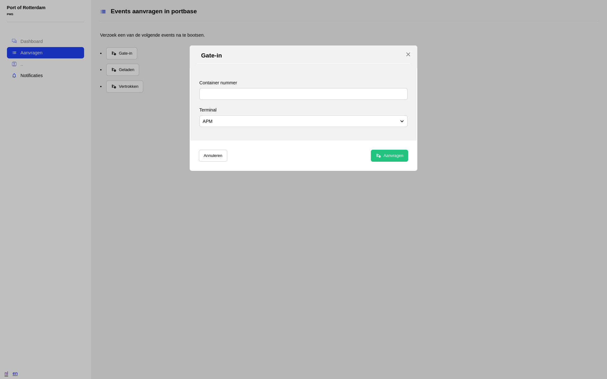

Vul het container nummer in: "BICU1234565" en druk op "Aanvragen".

#+ATTR_LATEX: :width 1.0\textwidth

\clearpage

** ERP

Vanuit het Portbase-systeem wordt nu de webhook die we geregistreerd
hebben aangeroepen met het aangevraagde event t.b.v. de container.
Het ERP zoekt de opdracht er automatisch bij, registreert het event
bij de opdracht en publiceert een vertaalde versie van het bericht
(van DCSA naar EPCIS) via de event broker t.b.v. andere luisteraars
zoals TMS-1.

Dat er events van Portbase geregistreerd zijn is te zien aan het
informatiebolletje bij de status van de opdracht.

#+ATTR_LATEX: :width 1.0\textwidth
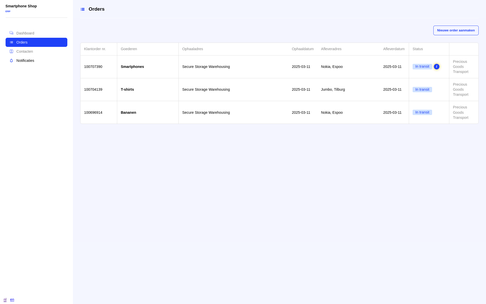

\clearpage

Druk op het bolletje voor meer informatie.

#+ATTR_LATEX: :width 1.0\textwidth
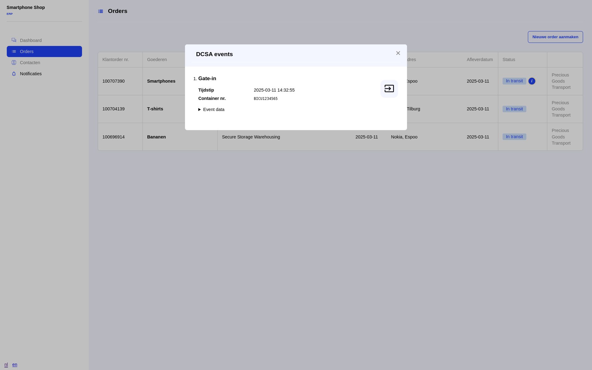

Druk op "event data" om het bericht te zien dat we hebben ontvangen.

#+ATTR_LATEX: :width 1.0\textwidth
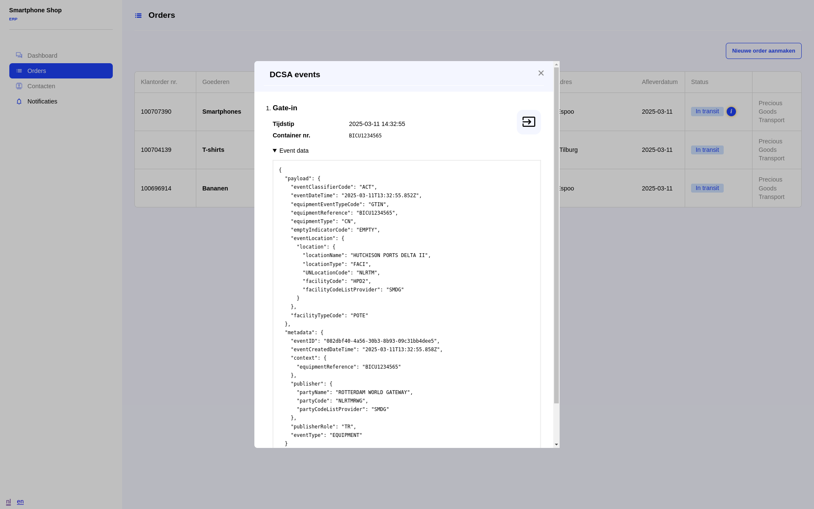

\clearpage

** TMS-1

In het TMS van het transportbedrijf is de opdracht nu "afgerond", de
container is immers afgeleverd.

#+ATTR_LATEX: :width 1.0\textwidth

\clearpage

** Geladen

Terug in het PMS simuleren we nu een "geladen" event: de container is
op een schip geladen.  Hiervoor hebben we weer het container nummer
nodig (BICU1234565) en het havenbezoek referentie nummer.  Dit
laatste mogen we zelf verzinnen en wordt in de praktijk toegewezen
door de havenmeester, we kiezen "demo-1".

#+ATTR_LATEX: :width 1.0\textwidth
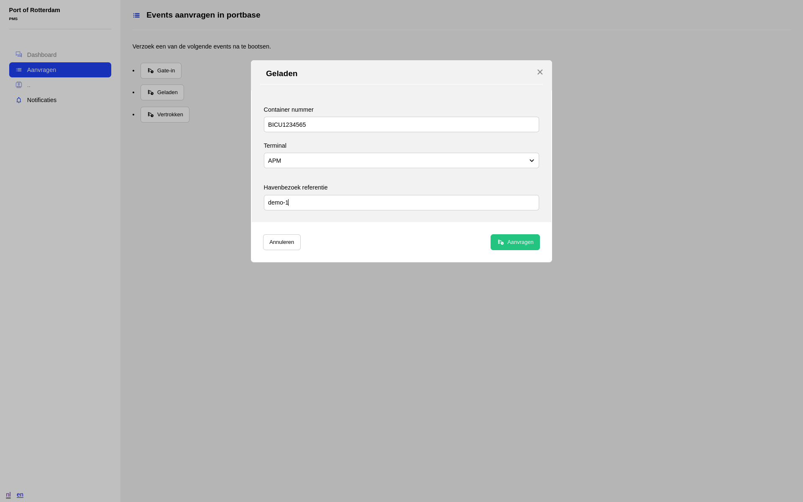

Druk op "Aanvragen".

#+ATTR_LATEX: :width 1.0\textwidth
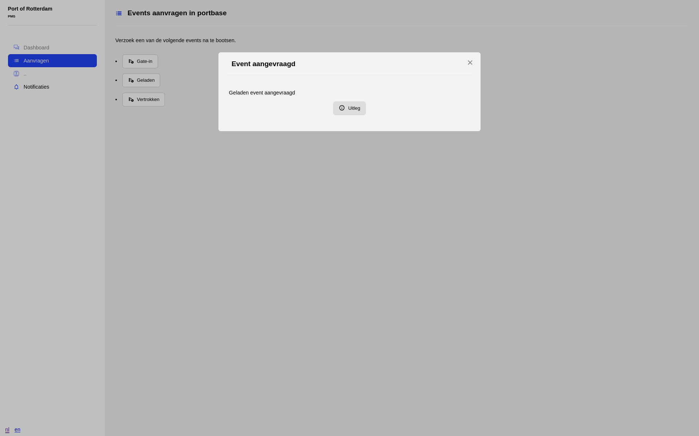

De webhook wordt weer aangeroepen en in het ERP wordt zichtbaar achter
het informatiebolletje dat de container op het schip geladen is.

#+ATTR_LATEX: :width 1.0\textwidth
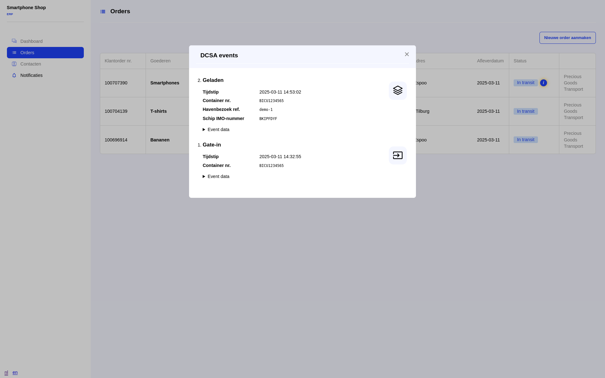

Hierbij is extra informatie vanuit Portbase toegevoegd: het IMO-nummer
van het schip ("BKIPFDYF") dat bij het havenbezoek referentie nummer
hoort waar de container opgeladen is.

Vanaf dit moment ontvangen we geen berichten meer van Portbase over
onze container, maar als we geïnteresseerd zijn in het vertrek van het
schip, moeten we ons abonneren op berichten over het schip.  Dit is
bij ontvangst van het "geladen" event automatisch door de applicatie
gedaan.  Het bericht is ook vertaald en gepubliceerd via de event
broker.  Van beide gebeurtenissen is in deze demo niets terug te
zien.

\clearpage

** Vertrokken

Terug in het PMS simuleren we nu een "vertrokken" event: het schip
waar onze container op staat, is vertrokken.  Hiervoor hebben we het
havenbezoek referentie nummer ("demo-1") en het schip IMO-nummer
("BKIPFDYF") nodig.

#+ATTR_LATEX: :width 1.0\textwidth
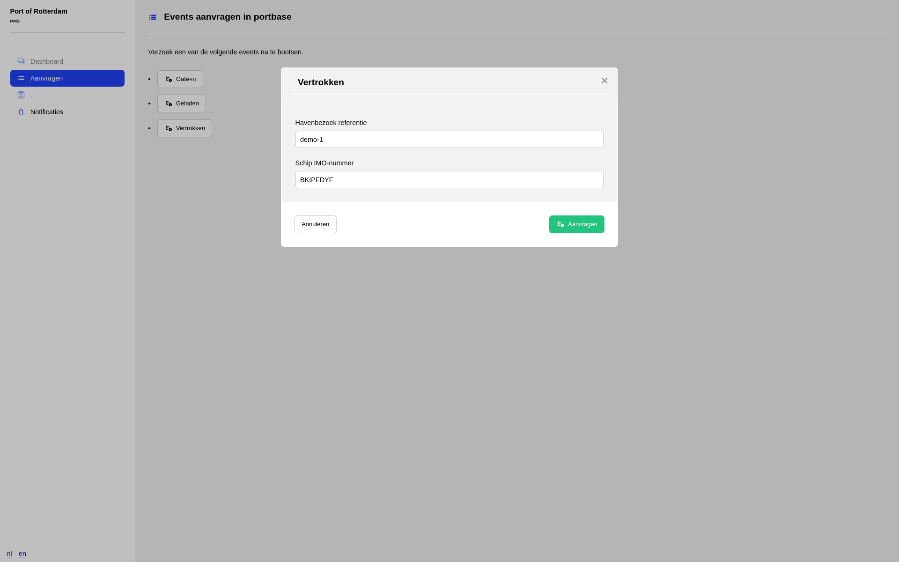

\clearpage

De webhook voor berichten over het schip wordt aangeroepen en in het
ERP wordt zichtbaar achter het informatiebolletje dat de container op
het schip geladen is.

#+ATTR_LATEX: :width 1.0\textwidth
[[./demo-script/scenario-3-erp-departed.png]]

* Org export configuratie                                          :noexport:

#+LATEX_CLASS_OPTIONS: [a4paper,11pt]
#+LATEX_HEADER: \setlength\parskip{\medskipamount}
#+LATEX_HEADER: \setlength\parindent{0pt}
#+LATEX_HEADER: \usepackage[dutch,shorthands=off]{babel}

# Local Variables:
# ispell-local-dictionary: "nl"
# org-export-default-language: "dutch"
# org-latex-image-default-option: "scale=0.5"
# org-latex-image-default-width: nil
# End:
